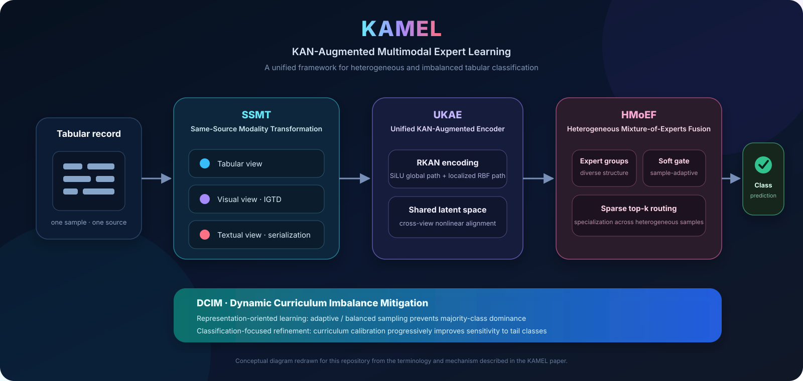

<div align="center">

# KAMEL

### KAN-Augmented Multimodal Expert Learning for Heterogeneous & Imbalanced Tabular Data

[](https://doi.org/10.1016/j.ins.2026.123925)
[](https://www.sciencedirect.com/science/article/pii/S002002552600856X)
[](https://pytorch.org/)
[](#benchmark-suite)

**Official implementation of**  
*“KAMEL: A universal KAN-augmented multimodal mixture-of-experts framework for learning heterogeneous and imbalanced tabular data”*  
**Information Sciences, 2026 · Article 123925**

[Paper](https://doi.org/10.1016/j.ins.2026.123925) · [Quick Start](#quick-start) · [Method](#method-at-a-glance) · [Benchmarks](#benchmark-suite) · [Citation](#citation)

</div>

<p align="center">
  
</p>

> **TL;DR.** KAMEL (**KAN-Augmented Multimodal Expert Learning**) is a unified framework for tabular classification under **distributional heterogeneity** and **class imbalance**. It converts one tabular sample into aligned tabular, visual, and textual views; encodes them with KAN-augmented representations; adaptively fuses them through heterogeneous experts; and uses a dynamic curriculum to reduce majority-class dominance and classifier bias.

## News

- **2026-07-20** — The KAMEL paper became available online in **Information Sciences** as Article **123925**.
- This repository provides the KAMEL implementation together with baseline comparison code used for tabular experiments.

## Why KAMEL?

Real-world tabular learning often faces two difficulties at the same time:

1. **Heterogeneity** — different samples or subgroups may follow different feature interactions and decision patterns.
2. **Class imbalance** — minority classes provide weaker supervision, which can distort both representation learning and decision boundaries.

KAMEL addresses these two issues jointly rather than treating them as isolated post-processing problems. The paper organizes the framework around four coordinated components: **SSMT**, **UKAE/RKAN**, **HMoEF**, and **DCIM**.

## Method at a Glance

| Component | Full name | Role in KAMEL |
|---|---|---|
| **SSMT** | Same-Source Modality Transformation | Converts each record into aligned **tabular**, **visual**, and **textual** views. The visual view is generated with **IGTD**; the text view is produced through feature serialization. |
| **UKAE** | Unified KAN-Augmented Encoder | Encodes the three views and projects them into a shared latent space for nonlinear cross-view alignment. |
| **RKAN** | Radial Basis Function KAN | The paper's KAN design combines a smooth global pathway with a localized **RBF** pathway. In this implementation, `fast_kan` follows the same dual-component idea through a SiLU base branch and an RBF branch. |
| **HMoEF** | Heterogeneous Mixture-of-Experts Fusion | Uses structurally diverse experts, a learned soft gate, and sparse top-*k* routing so different samples can activate different fusion behaviors. |
| **DCIM** | Dynamic Curriculum Imbalance Mitigation | Handles imbalance at both the representation and classifier levels through adaptive/balanced sampling followed by curriculum-oriented refinement. |

### 1. Same-source multimodal learning

KAMEL does **not** require naturally multimodal data. Starting from one tabular record, SSMT constructs three homologous views:

- **Tabular view** — preserves the original structured feature representation.
- **Visual view** — uses **Image Generator for Tabular Data (IGTD)** to place features on a 2-D layout while preserving feature-topology relationships.
- **Textual view** — serializes feature names and values into a semantically organized sequence.

The goal is to expose complementary structures from the same underlying sample instead of relying on a single feature geometry.

### 2. Unified KAN-augmented encoding

The three modalities are encoded into a shared embedding space. The paper centers this stage on **RKAN**, whose dual-component formulation combines global smooth nonlinear modeling and localized radial-basis responses.

The repository additionally exposes several KAN backends for controlled comparison:

```text
kan · fast_kan · cheby_kan · wave_kan
```

For the paper-aligned RBF-style encoder, use `--kan_type fast_kan`.

### 3. Heterogeneous expert fusion

HMoEF performs sample-adaptive multimodal fusion. Instead of making all experts identical, the implementation deliberately varies expert activation functions, normalization choices, widths, and depths. A learned gating network then performs **sparse top-k routing**, allowing different heterogeneous samples to specialize toward different experts.

The implementation includes unimodal-oriented, cross-modal, and higher-capacity synergy experts, together with load-balancing and diversity regularization signals.

### 4. Dynamic curriculum for imbalance

DCIM targets imbalance at two stages:

- **Representation-oriented learning** uses balanced/adaptive sampling to keep majority classes from dominating the learned embedding space.
- **Classification-focused refinement** gradually moves training toward the original distribution while maintaining stronger attention to difficult or minority-class samples.

This two-stage view is important: imbalance is treated as both a **representation problem** and a **decision-boundary problem**.

## Repository Structure

```text
KAMEL/
├── kamel/
│   ├── data/
│   │   ├── dataset_configs.py     # Dataset-specific preprocessing metadata
│   │   ├── preprocessor.py        # Tabular preprocessing and splits
│   │   └── transforms.py          # SSMT: IGTD + text transformation
│   ├── models/
│   │   ├── kamel_model.py         # End-to-end KAMEL model
│   │   ├── kan_encoders.py        # Tabular / image / text KAN encoders
│   │   ├── kan_layers.py          # KAN, Fast/RBF-KAN, ChebyKAN, WaveKAN
│   │   └── moe_fusion.py          # Heterogeneous MoE fusion and routing
│   ├── training/
│   │   ├── imbalance_handler.py   # Dynamic curriculum sampling
│   │   ├── losses.py              # Focal, LDAM, adaptive losses
│   │   ├── trainer.py             # Training procedure
│   │   └── train_utils.py
│   └── utils/                     # Metrics, configuration, visualization
├── model_comparison/              # Classical/deep tabular baselines
├── tabPFN/                        # TabPFN baseline source
├── tabicl_src/                    # TabICL baseline source
├── assets/                        # README / project figures
├── train_kamel.py                 # KAMEL training entry point
└── run_ml_comparison.py           # Baseline comparison entry point
```

## Installation

Clone the repository:

```bash
git clone https://github.com/jiaweine/KAMEL.git
cd KAMEL
```

The core KAMEL code uses the following Python stack:

```bash
pip install \
  torch numpy pandas scipy \
  scikit-learn imbalanced-learn \
  transformers optuna pyyaml \
  matplotlib seaborn
```

> Baseline models may require additional packages such as XGBoost, LightGBM, CatBoost, or model-specific dependencies. `tabPFN/` and `tabicl_src/` are included as baseline source trees.

## Quick Start

### Train KAMEL

A paper-aligned example using the RBF-style KAN encoder and curriculum imbalance handling:

```bash
python train_kamel.py \
  --dataset banknote \
  --data_path /path/to/banknote.csv \
  --model_size base \
  --kan_type fast_kan \
  --epochs 50 \
  --sampling_strategy curriculum \
  --loss_strategy focal \
  --device cuda \
  --seed 42
```

If CUDA is requested but unavailable, the training script automatically falls back to CPU.

### Important CLI arguments

| Argument | Choices / type | Default | Purpose |
|---|---|---:|---|
| `--dataset` | supported dataset alias | required | Select dataset configuration. |
| `--data_path` | path | `None` | Explicit CSV/data file path. |
| `--model_size` | `small`, `base`, `large`, `xlarge` | `base` | Model-scale preset. |
| `--kan_type` | `kan`, `fast_kan`, `cheby_kan`, `wave_kan` | `fast_kan` | KAN layer family. |
| `--epochs` | int | `10` | Total training epochs. |
| `--phase1_epochs` | int | `None` | Representation-learning phase length. |
| `--sampling_strategy` | `curriculum`, `balanced`, `smote` | `curriculum` | Imbalance sampling strategy. |
| `--loss_strategy` | `ldam`, `focal`, `adaptive`, `cross_entropy` | `ldam` | Imbalance-aware classification loss. |
| `--device` | `cuda`, `cpu` | `cuda` | Training device. |
| `--seed` | int | `42` | Random seed. |

> **Note on configuration precedence:** dataset-specific experiment configuration may define an imbalance loss internally; the training entry point only applies the CLI `--loss_strategy` when no loss strategy has already been configured.

## Benchmark Suite

The paper evaluates KAMEL on **25 public tabular classification datasets** spanning binary and multiclass tasks.

| Task | Datasets |
|---|---|
| **Binary (13)** | Banknote Authentication, Blood Transfusion, Breast Cancer Wisconsin, Diabetes, Haberman's Survival, Heart Disease, Hepatitis, Liver Disease / Liver Disorders, Mammographic Mass, MONK's-1, Parkinsons, Spambase, Vertebral Column |
| **Multiclass (12)** | Authorship Attribution, Car Evaluation, Cardiotocography, CMC, MFeat-Fourier, MFeat-Morphological, MFeat-Zernike, Nursery, Solar Flare, Vehicle Silhouettes, Wine Quality (Red), Yeast |

The CLI also contains configurations for additional datasets beyond the 25-dataset paper benchmark.

### Dataset files

Dataset configuration metadata is included under `kamel/data/`, but this repository currently does **not** vendor a root-level `data/` directory containing all benchmark CSV files. For a reproducible run, provide the corresponding local dataset path explicitly:

```bash
python train_kamel.py \
  --dataset spambase \
  --data_path /path/to/spambase.data \
  --device cuda
```

## Run Baseline Comparisons

Run all configured baselines for one dataset:

```bash
python run_ml_comparison.py \
  --dataset banknote \
  --algorithm all
```

Run a single baseline:

```bash
python run_ml_comparison.py \
  --dataset banknote \
  --algorithm xgboost
```

The comparison code covers tree ensembles, conventional machine-learning methods, deep tabular architectures, and tabular foundation-model baselines depending on the installed dependencies.

## Implementation Notes

A few details are useful when mapping the paper to the code:

- The paper name is **KAN-Augmented Multimodal Expert Learning (KAMEL)**.
- `kamel/data/transforms.py` implements the same-source visual/text transformations, including **IGTD** and tokenizer-based text processing.
- `kamel/models/kan_layers.py` implements several KAN families; `FastKANLayer` contains the dual **SiLU + RBF** computation corresponding most closely to the paper's RKAN description.
- `kamel/models/moe_fusion.py` implements heterogeneous expert architectures plus soft/sparse routing.
- `kamel/training/imbalance_handler.py` implements the two-phase curriculum sampler used to move from balanced representation learning toward the original data distribution.

## Paper

**KAMEL: A universal KAN-augmented multimodal mixture-of-experts framework for learning heterogeneous and imbalanced tabular data**  
*Information Sciences*, 2026, Article 123925.  
DOI: [`10.1016/j.ins.2026.123925`](https://doi.org/10.1016/j.ins.2026.123925)

The paper reports experiments on 25 public benchmark datasets and compares KAMEL against strong tree ensembles, deep tabular models, and tabular foundation models, with especially notable gains under highly imbalanced and heterogeneous settings.

## Citation

If this repository is useful in your work, please cite the publisher version:

```bibtex
@article{wang2026kamel,
  title   = {KAMEL: A universal KAN-augmented multimodal mixture-of-experts framework for learning heterogeneous and imbalanced tabular data},
  author  = {Wang, Jiawei and others},
  journal = {Information Sciences},
  year    = {2026},
  pages   = {123925},
  doi     = {10.1016/j.ins.2026.123925}
}
```

> The publisher page is the source of truth for the final author list, issue/volume information, and citation metadata.

## Acknowledgement

This repository includes or interfaces with several open-source tabular-learning baselines. Please also cite the original works for the individual baseline methods you use in experiments.

---

<div align="center">
  <sub>Built for studying tabular learning where <b>heterogeneity</b>, <b>multimodal representation</b>, and <b>class imbalance</b> meet.</sub>
</div>
